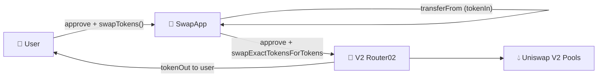

# 🔄 Swapping

[](https://github.com/noelialuz/Swapping)
[](https://soliditylang.org/)
[](https://opensource.org/licenses/MIT)
[](https://ethereum.org/)
[](https://getfoundry.sh/)

> **A minimal Solidity wrapper around Uniswap V2 Router02 that lets users swap ERC-20 tokens through a single `swapTokens` entry point.**

Swapping is a learning-oriented Foundry project that integrates with an existing **Uniswap V2–compatible router** (Router02). Users approve the contract, call `swapTokens` with a token path and slippage parameters, and receive output tokens directly in their wallet. The contract pulls input tokens via **OpenZeppelin SafeERC20**, approves the router, and delegates the swap to `swapExactTokensForTokens`.

**Key features:**

- 🔁 Single `swapTokens()` function wrapping `swapExactTokensForTokens`
- 🧩 Minimal `IV2Router02` interface — no full router dependency in source
- 🛡️ **SafeERC20** for `transferFrom` and `approve`
- 📣 `SwapTokens` event with input/output token addresses and amounts
- 🧪 Foundry test suite with optional **Arbitrum mainnet fork**
- 🔗 Configurable router address set at deploy time

---

## 📋 Table of Contents

1. [Prerequisites & Dependencies](#-prerequisites--dependencies)
2. [Technologies & Versions](#-technologies--versions)
3. [Project Structure](#-project-structure)
4. [Quick Start](#-quick-start)
5. [Testing the Contract](#-testing-the-contract)
6. [Architecture](#-architecture)
7. [Security Policy](#-security-policy)
8. [Scripts & Commands](#-scripts--commands)
9. [Versioning](#-versioning)
10. [License](#-license)
11. [About the Author](#-about-the-author)

---

## 📦 Prerequisites & Dependencies

### System requirements

| Requirement | Notes |
| :-- | :-- |
| 🖥️ **OS** | macOS, Linux, or Windows |
| 🔧 **Git** | Required for cloning and submodules |
| ⚒️ **Foundry** | `forge`, `cast`, and `anvil` for build and test |
| 🌐 **RPC URL** (optional) | Arbitrum (or target chain) endpoint for fork tests |

**Quick minimum:** [Foundry](https://getfoundry.sh/) installed and Solidity compiler **0.8.35**.

### Install Foundry

```bash
curl -L https://foundry.paradigm.xyz | bash
foundryup
```

Verify:

```bash
forge --version
cast --version
```

### Project dependencies

| Dependency | Role |
| :-- | :-- |
| [forge-std](https://github.com/foundry-rs/forge-std) | Foundry testing utilities and cheatcodes |
| [OpenZeppelin Contracts](https://github.com/OpenZeppelin/openzeppelin-contracts) | `IERC20` and `SafeERC20` for safe token transfers |

After cloning, install submodules if needed:

```bash
git clone https://github.com/noelialuz/Swapping.git
cd Swapping
forge install
```

---

## 🛠 Technologies & Versions

| Technology | Version | Role |
| :-- | :-- | :-- |
| **Solidity** | `0.8.35` | Smart contract language |
| **Foundry** | latest (`foundryup`) | Build, test, and CLI interaction |
| **OpenZeppelin Contracts** | vendored in `lib/` | ERC-20 interfaces and SafeERC20 |
| **Uniswap V2 Router02** | external (on-chain) | DEX router for token swaps |
| **EVM** | — | Execution environment (Ethereum-compatible chains) |
| **SPDX** | `MIT` | License identifier in source |

---

## 📁 Project Structure

```bash
Swapping/
├── foundry.toml                    # Foundry configuration
├── README.md                       # Project documentation
├── lib/
│   ├── forge-std/                  # Foundry standard library
│   └── openzeppelin-contracts/     # OpenZeppelin (IERC20, SafeERC20)
├── src/
│   ├── SwapApp.sol                 # Main swap wrapper contract
│   └── interfaces/
│       └── IV2Router02.sol         # Minimal Router02 interface
├── test/
│   └── SwapApp.t.sol               # Unit and fork tests
└── .vscode/                        # Editor remappings (optional)
```

This repository is a **Foundry-first** project. The router itself is not deployed here — you point `SwapApp` at an existing V2-compatible Router02 address on your target network.

---

## 🚀 Quick Start

### 1. Clone and build

```bash
git clone https://github.com/noelialuz/Swapping.git
cd Swapping
forge build
```

### 2. Deploy

Deploy `SwapApp` with the Router02 address for your network.

**Example — Arbitrum mainnet Router02:**

| Field | Value |
| :-- | :-- |
| **Contract** | `SwapApp` |
| **`V2Router02Address_`** | `0x4752ba5DBc23f44D87826276BF6Fd6b1C372aD24` |

Using Foundry (local or scripted):

```bash
# Example: deploy to a local Anvil node
anvil &
forge create src/SwapApp.sol:SwapApp \
  --rpc-url http://127.0.0.1:8545 \
  --private-key <DEPLOYER_PRIVATE_KEY> \
  --constructor-args 0x4752ba5DBc23f44D87826276BF6Fd6b1C372aD24
```

> Use the correct Router02 address for your chain. The address above is for reference in the included Arbitrum fork tests.

### 3. Swap tokens

```solidity
// 1. User approves SwapApp to spend tokenIn.
IERC20(tokenIn).approve(swapAppAddress, amountIn);

// 2. Build path: [tokenIn, tokenOut] (add intermediates for multi-hop).
address[] memory path = new address[](2);
path[0] = tokenIn;
path[1] = tokenOut;

// 3. Call swapTokens with slippage and deadline.
swapApp.swapTokens(amountIn, amountOutMin, path, deadline);
// Output tokens are sent directly to msg.sender by the router.
```

**Example — USDT → DAI on Arbitrum (test constants):**

| Token | Address |
| :-- | :-- |
| USDT | `0xFd086bC7CD5C481DCC9C85ebE478A1C0b69FCbb9` |
| DAI | `0xDA10009cBd5D07dd0CeCc66161FC93D7c9000da1` |

---

## 🧪 Testing the Contract

### Option A — Local tests (no fork)

Runs deployment smoke test only:

```bash
forge test -vv
```

Expected: `testHasBeenDeployedCorrectly` passes. The swap integration test requires a mainnet fork (see below).

### Option B — Arbitrum fork test (recommended)

The swap test forks Arbitrum mainnet and uses a funded address with USDT:

```bash
forge test -vvvv \
  --fork-url https://arb1.arbitrum.io/rpc \
  --match-test testSwapTokensCorrectly
```

Or run the full suite on a fork:

```bash
forge test -vv --fork-url https://arb1.arbitrum.io/rpc
```

**What the fork test verifies:**

| Step | Action |
| :-- | :-- |
| 1 | Deploy `SwapApp` with Arbitrum Router02 |
| 2 | Impersonate a USDT holder on Arbitrum |
| 3 | Approve `SwapApp` and call `swapTokens(USDT → DAI)` |
| 4 | Assert USDT balance decreased and DAI balance increased |

> **Note:** Fork tests depend on live chain state (token balances, liquidity). If the hard-coded holder address no longer has USDT, update `user` in [`test/SwapApp.t.sol`](./test/SwapApp.t.sol).

### Option C — Manual interaction with `cast`

After deploying `SwapApp` on a testnet or fork:

```bash
# Approve SwapApp (from user wallet)
cast send $USDT "approve(address,uint256)" $SWAP_APP $AMOUNT_IN --private-key $USER_PK

# Swap USDT for DAI
cast send $SWAP_APP \
  "swapTokens(uint256,uint256,address[],uint256)" \
  $AMOUNT_IN \
  $AMOUNT_OUT_MIN \
  "[$USDT,$DAI]" \
  $DEADLINE \
  --private-key $USER_PK
```

### Option D — Remix (optional)

1. Copy [`src/SwapApp.sol`](./src/SwapApp.sol) and [`src/interfaces/IV2Router02.sol`](./src/interfaces/IV2Router02.sol) into Remix.
2. Add OpenZeppelin imports via Remix GitHub import or flatten the contract.
3. Compile with Solidity **0.8.35**.
4. Deploy with your network's Router02 address.
5. Approve tokens to the deployed contract, then call `swapTokens`.

---

## 🗄 Architecture

Swapping consists of a thin wrapper contract that sits between the user and an on-chain DEX router:



### Contract responsibilities

| Contract / Interface | Responsibility |
| :-- | :-- |
| **`SwapApp`** | Pulls input tokens, approves router, executes swap, emits event |
| **`IV2Router02`** | Minimal interface for `swapExactTokensForTokens` |

### Core state

| Variable | Visibility | Description |
| :-- | :-- | :-- |
| `V2Router02Address` | `public` | Address of the Uniswap V2–compatible router |

### Write functions

| Function | Access | Description |
| :-- | :-- | :-- |
| `swapTokens(uint256 amountIn_, uint256 amountOutMin_, address[] path_, uint256 deadline_)` | `external` | Transfers `path_[0]` from caller, swaps via router, sends output to caller |

### Events

```solidity
event SwapTokens(address tokenIn, address tokenOut, uint256 amountIn, uint256 amountOut);
```

### Swap flow

1. **Approve** — User grants `SwapApp` allowance on the input ERC-20.
2. **Transfer in** — `SwapApp` pulls `amountIn_` from `msg.sender` using SafeERC20.
3. **Router approve** — Contract approves the router to spend the input token.
4. **Swap** — Router executes `swapExactTokensForTokens`; output goes to `msg.sender`.
5. **Event** — `SwapTokens` logs token addresses and amounts.

### Parameters

| Parameter | Description |
| :-- | :-- |
| `amountIn_` | Exact input token amount |
| `amountOutMin_` | Minimum acceptable output (slippage protection) |
| `path_` | Token addresses from input to output (e.g. `[USDT, DAI]`) |
| `deadline_` | Unix timestamp after which the swap reverts |

---

## 🔐 Security Policy

> ⚠️ **This project is intended for learning and demonstration purposes only.** It has **not** undergone a professional security audit.

### Known considerations

| Area | Detail |
| :-- | :-- |
| 🎓 **Educational scope** | Not production-ready; use at your own risk |
| 🔗 **External router trust** | Swaps depend entirely on the configured Router02 and underlying pools |
| 💸 **No fee-on-transfer handling** | Assumes standard ERC-20 behavior; deflationary/rebasing tokens may break swaps |
| ⏱️ **Deadline & slippage** | Caller must set sensible `deadline_` and `amountOutMin_`; no defaults enforced |
| 🔓 **Unlimited approve** | Contract approves the router for the full `amountIn_` per swap |
| 🌐 **Network-specific** | Router and token addresses differ per chain — verify before deployment |
| 🧪 **Test first** | Use fork tests or a testnet before mainnet |

### Before using in production

- [ ] Review all logic in [`src/SwapApp.sol`](./src/SwapApp.sol)
- [ ] Run fork tests against your target chain and router
- [ ] Consider a professional audit
- [ ] Add pausing, access control, or router upgrade patterns if needed
- [ ] Validate token paths and liquidity on-chain

### Reporting vulnerabilities

If you discover a security issue, please **do not** open a public GitHub issue. Contact the repository owner directly (see [About the Author](#-about-the-author)).

Smart contracts carry inherent technical and financial risk. Use this repository at your own responsibility.

---

## 📜 Scripts & Commands

| Command | Description |
| :-- | :-- |
| `forge build` | Compile contracts |
| `forge test -vv` | Run tests locally |
| `forge test --fork-url <RPC_URL>` | Run tests against a forked network |
| `forge test -vvvv --fork-url https://arb1.arbitrum.io/rpc --match-test testSwapTokensCorrectly` | Verbose Arbitrum swap test |
| `forge create src/SwapApp.sol:SwapApp --constructor-args <ROUTER>` | Deploy via CLI |
| `anvil` | Start a local Ethereum node |
| `cast send ... "swapTokens(...)"` | Execute a swap on a deployed contract |

---

## 📌 Versioning

This project follows **[Semantic Versioning 2.0.0](https://semver.org/)**:

| Segment | Meaning |
| :-- | :-- |
| **MAJOR** | Breaking changes to contract interface or behavior |
| **MINOR** | New features, backward-compatible |
| **PATCH** | Bug fixes, docs, no breaking API changes |

### Release history

| Version | Status | Notes |
| :-- | :-- | :-- |
| **0.1.0** | Current | Initial release: `SwapApp`, `IV2Router02`, Foundry tests with Arbitrum fork |

Tag releases on GitHub:

```bash
git tag -a v0.1.0 -m "Initial SwapApp release with V2 router integration"
git push origin v0.1.0
```

---

## 📄 License

Swapping is released under the **MIT License** — see the SPDX header in [`src/SwapApp.sol`](./src/SwapApp.sol).

SPDX identifier: `// SPDX-License-Identifier: MIT`

---

## 👤 About the Author

| | |
| :-- | :-- |
| **Name** | Noelia Luz Fernández |
| **GitHub** | [@Noelialuz](https://github.com/noelialuz) |
| **LinkedIn** | https://www.linkedin.com/in/noelia-luz-fernandez-03404440/ |
| **Email** | noelia_luz_fernandez@hotmail.com |

---

## 📚 Learn More

- [Foundry Book](https://book.getfoundry.sh/) — CLI testing, forking, and cheatcodes
- [Uniswap V2 documentation](https://docs.uniswap.org/contracts/v2/overview) — Router02 and swap mechanics
- [OpenZeppelin SafeERC20](https://docs.openzeppelin.com/contracts/api/token/erc20#SafeERC20) — safe token transfer patterns
- [Solidity documentation](https://docs.soliditylang.org/) — language reference and best practices
